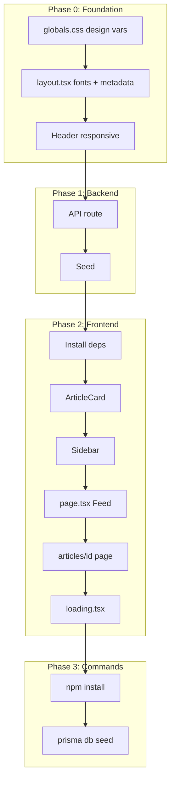

# 📅 วันที่ 1 — Foundation (รากฐาน)

เป้าหมายวันนี้: สร้างโครงสร้างโปรเจกต์, ระบบ Auth, และ Feed แสดงบทความได้

> 📖 [กลับไปหน้าหลัก](LEARNING_GUIDE.md)

---

## Step 1.1 — Setup โปรเจกต์

### ทำอะไร
- สร้างโปรเจกต์ Next.js 14 ด้วย App Router
- ติดตั้ง Prisma และเชื่อมต่อ PostgreSQL
- ติดตั้ง Tailwind CSS
- สร้าง Layout พื้นฐาน (Header, Navigation)

### อธิบาย
- **Next.js 14 App Router** — โครงสร้างใหม่ใช้โฟลเดอร์ `app/` แทน `pages/` รองรับ Server Components, Layouts, และ API Routes
- **Prisma** — ORM ที่ช่วยเขียน query แบบ type-safe และจัดการ migration
- **PostgreSQL** — ฐานข้อมูลที่ต้อง setup server รันได้ทันที เหมาะกับ development
- **Layout** — ใช้ `app/layout.tsx` เป็น root layout แสดง Header/Nav ซ้ำทุกหน้า

### Backend
1. `npx create-next-app@latest` เลือก App Router, Tailwind, TypeScript
2. `npm install prisma @prisma/client`
3. `npx prisma init`
4. แก้ `DATABASE_URL` ใน `.env` เป็น `postgresql://localhost:5432/medium` (PostgreSQL — ไม่ต้อง setup อะไรเพิ่ม)

### Frontend
1. สร้าง `app/layout.tsx` — ใส่ `<html>`, `<body>`, font (เช่น Inter)
2. สร้าง `components/Header.tsx` — logo, ลิงก์ไป `/`, `/login`, `/register`
3. สร้าง `components/Nav.tsx` — เมนูนำทาง (ถ้าแยกจาก Header)
4. ใช้ Tailwind จัด layout พื้นฐาน เช่น `max-w-4xl mx-auto px-4`

### Code (Theme: ขาวดำ minimal)

**`app/layout.tsx`** — ใส่ `suppressHydrationWarning` ที่ html/body เพื่อลด hydration warning จาก browser extensions
```tsx
import type { Metadata } from "next";
import { Inter } from "next/font/google";
import "./globals.css";
import Header from "./components/Header";

const inter = Inter({
  variable: "--font-geist-sans",
  subsets: ["latin"],
});

export const metadata: Metadata = {
  title: "Create Next App",
  description: "Generated by create next app",
};

export default function RootLayout({
  children,
}: Readonly<{
  children: React.ReactNode;
}>) {
  return (
    <html lang="th" className="bg-white text-black" suppressHydrationWarning>
      <body className={`${inter.className} min-h-screen antialiased`} suppressHydrationWarning>
        <Header />
        <main className="max-w-2xl mx-auto px-4 py-8">{children}</main>
      </body>
    </html>
  )
}
```

**`components/Header.tsx`** (เมื่อ login แสดง Profile, ตั้งค่า, ชื่อ user, Logout)

⚠️ **Hydration fix:** ใช้ `mounted` state — แสดง Login/Register ก่อน mount เพื่อให้ server/client render เหมือนกัน แล้วค่อยอ่าน localStorage
```tsx
'use client'

import Link from 'next/link'
import { useRouter } from 'next/navigation'
import { useEffect, useState } from 'react'

export default function Header() {
  return (
    <header className="border-b border-gray-200 bg-white">
      <nav className="max-w-2xl mx-auto px-4 py-4 flex items-center justify-between">
        <Link href="/" className="text-xl font-semibold text-black hover:text-gray-600">
          Medium
        </Link>
        <div className="flex gap-4 items-center" suppressHydrationWarning>
            <>
              <Link href="/login" className="text-gray-600 hover:text-black">Login</Link>
              <Link href="/register" className="text-gray-600 hover:text-black">Register</Link>
            </>
        </div>
      </nav>
    </header>
  )
}
```

---

## Step 1.2 — Database schema + Status + DBML

### ทำอะไร
- ออกแบบ schema ใน `prisma/schema.prisma` ให้ตรงกับแบบจำลองใน `schema.dbml`
- สร้าง tables/models: `status`, `user`, `article`, `article_like` (สำหรับ Like ใน DAY_2)
- รัน migration และ seed ตาราง `status`
- สร้าง Prisma Client singleton
- เขียน `schema.dbml` เป็นเอกสารโครงสร้าง DB แบบ DBML (ไฟล์หลักอ้างอิงโครงสร้าง)

### อธิบาย
- **Status (`status`)** — 1=Active, 2=Inactive, 3=Deleted (ใช้ soft delete, เก็บใน table `status`)
- **User (`user`)** — เก็บ id, email, password, name, `status_id`, `created_at`, `updated_at`
- **Article (`article`)** — เก็บ id, title, content, `user_id`, `status_id`, `created_at`, `updated_at`
- **ArticleLike (`article_like`)** — เก็บการกด like ของ user ต่อบทความ, ใช้คู่ key (`user_id`, `article_id`) ให้ like ได้ครั้งเดียว
- **Relation** — ทุก table ที่มี `status_id` จะชี้ไปที่ `status.id`
- **schema.dbml** — ไฟล์ DBML ใช้ดูโครงสร้างตารางและความสัมพันธ์ (source of truth ของโครงสร้าง DB)

### Backend
1. เขียน schema ใน `prisma/schema.prisma` ตามแบบ `schema.dbml`
2. สร้าง `.env` มี `DATABASE_URL="file:./dev.db"`
3. สร้าง `lib/prisma.ts` — export PrismaClient singleton
4. สร้าง `prisma/seed.ts` — ใส่ข้อมูล status (Active, Inactive, Deleted)
5. ใช้ `schema.dbml` เป็นโครงสร้าง DB แบบ DBML ดูได้ที่ [schema.dbml](schema.dbml)

### คำสั่งที่ต้องรัน (Run)

รันตามลำดับ:

| ลำดับ | คำสั่ง | ทำอะไร |
|-------|--------|--------|
| 1 | `npx prisma generate` | สร้าง Prisma Client จาก schema (ต้องรันทุกครั้งที่แก้ schema) |
| 2 | `npx prisma migrate dev --name init` | สร้าง migration + ตารางใน DB (ครั้งแรกใช้ `--name init`) |
| 3 | `npx prisma db seed` | รัน seed ใส่ข้อมูลตาราง `status` (1 Active, 2 Inactive, 3 Deleted) |

**หมายเหตุ**
- ก่อนรัน `db seed` ต้องตั้งค่าใน `package.json`: `"prisma": { "seed": "npx tsx prisma/seed.ts" }` และติดตั้ง tsx (`npm i -D tsx`) — แนะนำใช้ tsx เพราะรองรับ ESM และ custom output ของ Prisma ได้ดี
- ถ้า schema กำหนด `output` เป็น path อื่น (เช่น `../app/generated/prisma`) ใน `prisma/seed.ts` ต้อง import จาก path นั้น ไม่ใช่ `@prisma/client` (เช่น `import { PrismaClient } from '../app/generated/prisma/client'`)
- แก้ `schema.prisma` แล้วต้องรัน `npx prisma generate` ใหม่
- มี migration เพิ่มในครั้งถัดไป: ใช้ `npx prisma migrate dev --name <ชื่อการเปลี่ยนแปลง>`

### Frontend
- Step นี้เป็น backend เป็นหลัก — ยังไม่ต้องทำ UI เพิ่ม

### Code

**`schema.dbml`**
```dbml
// ============================================
// Medium Clone — Database Schema (DBML)
// ============================================

// สถานะ (Active / Inactive / Deleted)
Table status {
  id integer [primary key, not null, note: "รหัสสถานะ (PK) — 1=Active, 2=Inactive, 3=Deleted"]
  name varchar [not null, note: "ชื่อสถานะ"]
}

// ผู้ใช้
Table user {
  id varchar [primary key, not null, note: "รหัสผู้ใช้ (PK, CUID)"]
  email varchar [not null, unique, note: "อีเมล (unique)"]
  password varchar [not null, note: "รหัสผ่าน (hash)"]
  name varchar [not null, note: "ชื่อผู้ใช้"]
  status_id integer [not null, default: 1, ref: > status.id, note: "สถานะ (FK -> status.id)"]
  created_at timestamp [not null, note: "วันที่สร้างข้อมูล"]
  updated_at timestamp [not null, note: "วันที่แก้ไขล่าสุด"]

  Indexes {
    email [unique]
    status_id
  }
}

// บทความ
Table article {
  id varchar [primary key, not null, note: "รหัสบทความ (PK, CUID)"]
  title varchar [not null, note: "หัวข้อบทความ"]
  content text [not null, note: "เนื้อหาบทความ (HTML จาก Rich Text Editor)"]
  user_id varchar [not null, ref: > user.id, note: "รหัสผู้เขียน (FK -> user.id, CASCADE on delete)"]
  status_id integer [not null, default: 1, ref: > status.id, note: "สถานะ (FK -> status.id)"]
  created_at timestamp [not null, note: "วันที่สร้างข้อมูล"]
  updated_at timestamp [not null, note: "วันที่แก้ไขล่าสุด"]

  Indexes {
    user_id
    status_id
    (user_id, created_at) [note: "สำหรับดึงบทความของ user เรียงตามวันที่"]
  }
}

// =========================
// หมวดหมู่ (Category)
// =========================
Table category {
  id integer [primary key, not null, note: "รหัสหมวดหมู่ (PK, AUTO_INCREMENT)"]
  name varchar [not null, unique, note: "ชื่อหมวดหมู่ (unique)"]
  status_id integer [not null, default: 1, ref: > status.id, note: "สถานะ (FK -> status.id)"]
  created_at timestamp [not null, note: "วันที่สร้างข้อมูล"]
  updated_at timestamp [not null, note: "วันที่แก้ไขล่าสุด"]

  Indexes {
    name [unique]
    status_id
  }
}

// บทความหนึ่งอยู่ได้หลายหมวด, หมวดหนึ่งมีหลายบทความ
Table article_category {
  id integer [primary key, not null, note: "รหัส (PK, AUTO_INCREMENT)"]
  article_id varchar [not null, ref: > article.id, note: "รหัสบทความ (FK -> article.id, CASCADE on delete)"]
  category_id integer [not null, ref: > category.id, note: "รหัสหมวดหมู่ (FK -> category.id)"]
  created_at timestamp [not null, note: "วันที่สร้างความสัมพันธ์"]
  updated_at timestamp [not null, note: "วันที่แก้ไขล่าสุด"]

  Indexes {
    (article_id, category_id) [unique, note: "หนึ่งบทความ-หนึ่งหมวดหมู่ มีได้ครั้งเดียว"]
    article_id
    category_id
  }
}


// Like บทความ (หนึ่ง user like หนึ่งบทความได้ครั้งเดียว)
Table article_like {
  id varchar [primary key, not null, note: "รหัส (PK, CUID)"]
  user_id varchar [not null, ref: > user.id, note: "ผู้ใช้ (FK -> user.id)"]
  article_id varchar [not null, ref: > article.id, note: "บทความ (FK -> article.id)"]
  status_id integer [not null, default: 1, ref: > status.id, note: "สถานะ (FK -> status.id)"]
  created_at timestamp [not null, note: "วันที่ like"]
  updated_at timestamp [not null, note: "วันที่แก้ไขล่าสุด"]

  Indexes {
    (user_id, article_id) [unique, note: "หนึ่ง user like หนึ่งบทความได้ครั้งเดียว"]
    article_id
  }
}

```

**`prisma/schema.prisma` (เฉพาะส่วน model)**  
```prisma
generator client {
  provider = "prisma-client"
  output   = "../app/generated/prisma"
}

datasource db {
  provider = "postgresql"
  url      = env("DATABASE_URL")
}

model Status {
  id                Int               @id
  name              String
  users             User[]
  articles          Article[]
  likes             ArticleLike[]
  categories        Category[]
  articleCategories ArticleCategory[]

  @@map("status")
}

model User {
  id        String        @id @default(cuid())
  email     String        @unique
  password  String
  name      String
  statusId  Int           @default(1) @map("status_id")
  status    Status        @relation(fields: [statusId], references: [id])
  createdAt DateTime      @default(now()) @map("created_at")
  updatedAt DateTime      @default(now()) @updatedAt @map("updated_at")
  articles  Article[]
  likes     ArticleLike[]

  @@map("user")
}

model Category {
  id        Int           @id
  name      String        @unique
  statusId  Int           @default(1) @map("status_id")
  status    Status        @relation(fields: [statusId], references: [id])
  createdAt DateTime      @default(now()) @map("created_at")
  updatedAt DateTime      @default(now()) @updatedAt @map("updated_at")
  articles  ArticleCategory[]

  @@map("category")
}

model Article {
  id        String        @id @default(cuid())
  title     String
  content   String
  authorId  String        @map("user_id")
  author    User          @relation(fields: [authorId], references: [id])
  statusId  Int           @default(1) @map("status_id")
  status    Status        @relation(fields: [statusId], references: [id])
  createdAt DateTime      @default(now()) @map("created_at")
  updatedAt DateTime      @default(now()) @updatedAt @map("updated_at")
  likes     ArticleLike[]
  categories ArticleCategory[]

  @@map("article")
}

model ArticleCategory {
  id         Int      @id
  articleId  String   @map("article_id")
  article    Article  @relation(fields: [articleId], references: [id])
  categoryId Int      @map("category_id")
  category   Category @relation(fields: [categoryId], references: [id])
  statusId   Int      @default(1) @map("status_id")
  status     Status   @relation(fields: [statusId], references: [id])
  createdAt  DateTime @default(now()) @map("created_at")
  updatedAt  DateTime @default(now()) @updatedAt @map("updated_at")

  @@map("article_category")
}

model ArticleLike {
  id        String   @id @default(cuid())
  userId    String   @map("user_id")
  user      User     @relation(fields: [userId], references: [id])
  articleId String   @map("article_id")
  article   Article  @relation(fields: [articleId], references: [id])
  statusId  Int      @default(1) @map("status_id")
  status    Status   @relation(fields: [statusId], references: [id])
  createdAt DateTime @default(now()) @map("created_at")
  updatedAt DateTime @default(now()) @updatedAt @map("updated_at")

  @@unique([userId, articleId])
  @@map("article_like")
}
```

**`prisma/seed.ts`**
```ts
import { prisma } from '../lib/prisma'

async function main() {
  await prisma.status.upsert({
    where: { id: 1 },
    update: {},
    create: { id: 1, name: 'Active' },
  })

  await prisma.status.upsert({
    where: { id: 2 },
    update: {},
    create: { id: 2, name: 'Inactive' },
  })

  await prisma.status.upsert({
    where: { id: 3 },
    update: {},
    create: { id: 3, name: 'Deleted' },
  })

  // Seed categories from design (Recommended topics)
  const categories = [
    { id: 1, name: 'Programming' },
    { id: 2, name: 'Data Science' },
    { id: 3, name: 'UX' },
    { id: 4, name: 'Startup' },
    { id: 5, name: 'Writing' },
    { id: 6, name: 'Psychology' },
  ]
  for (const { id, name } of categories) {
    await prisma.category.upsert({
      where: { id },
      update: { name },
      create: { id, name, statusId: 1 },
    })
  }

  // Seed demo user and articles for Feed (Step 1.3)
  const demoUser = await prisma.user.upsert({
    where: { email: 'demo@medium.local' },
    update: {},
    create: {
      email: 'demo@medium.local',
      password: 'Pass@word123',
      name: 'Demo Author',
      statusId: 1,
    },
  })

  // Reset demo articles on re-seed
  await prisma.article.deleteMany({ where: { authorId: demoUser.id } })

  const articles = [
    {
      title: 'The Future of Human-Computer Interaction in 2025',
      content:
        '<p>As AI systems become more capable, the relationship between humans and computers is evolving in unexpected ways. This article explores the trends shaping our digital future.</p><p>From voice interfaces to ambient computing, we are moving toward a world where technology fades into the background.</p>',
    },
    {
      title: 'The Last Programmer — A Short Story About AI',
      content:
        '<p>Artificial intelligence is no longer a distant dream. It is here, and it is changing how we work, create, and connect.</p>',
    },
    {
      title: 'Building a Medium Clone with Next.js and Prisma',
      content:
        '<p>Learn how to build a blog platform similar to Medium using Next.js 16, Prisma, and Tailwind CSS. We will cover authentication, article CRUD, and a responsive feed layout.</p>',
    },
  ]

  for (const { title, content } of articles) {
    await prisma.article.create({
      data: { title, content, authorId: demoUser.id, statusId: 1 },
    })
  }
}

main()
  .catch((e) => {
    console.error(e)
    process.exit(1)
  })
  .finally(async () => {
    await prisma.$disconnect()
  })


```

**`lib/prisma.ts`**

ใช้แบบ **singleton** — สร้าง Prisma Client แค่ instance เดียว แล้ว reuse ตลอดทั้ง app  

- **เหตุผล:** ในโหมด development เวลา hot reload (เช่น Next.js) ถ้า `new PrismaClient()` ถูกเรียกหลายครั้ง จะมี connection ไปที่ DB เยอะจนเกิน limit ได้  
- **วิธีทำ:** เก็บ instance ไว้ใน `globalThis` (ใน Node/Edge ไม่หายเมื่อไฟล์ถูกโหลดใหม่) ถ้ามีอยู่แล้วใช้ตัวเดิม ไม่มีค่อยสร้างใหม่  
- **production:** มักโหลดครั้งเดียว จึงไม่จำเป็นต้องเก็บใน global ก็ได้ แต่ใช้ pattern เดียวกันได้ไม่มีปัญหา  

```ts
import { PrismaClient } from '@prisma/client'

const globalForPrisma = globalThis as unknown as { prisma: PrismaClient }
export const prisma = globalForPrisma.prisma || new PrismaClient()
if (process.env.NODE_ENV !== 'production') globalForPrisma.prisma = prisma
```

**โครงสร้าง DB (DBML)** — ดูรายละเอียดตารางและความสัมพันธ์ใน [schema.dbml](schema.dbml)

---

## Step 1.3 — Articles API + Feed

### ทำอะไร
- สร้าง API `GET /api/articles` สำหรับดึงรายการบทความแบบ pagination
- สร้างหน้า Feed (Home) แสดงรายการบทความจาก DB
- สร้างหน้ารายละเอียดบทความ `/articles/[id]`
- สร้าง component `ArticleCard` และ `Sidebar`
- สร้าง `loading.tsx` สำหรับ skeleton loading
- เพิ่ม seed ข้อมูล demo user และบทความตัวอย่าง

### อธิบาย
- **GET /api/articles** — คืนรายการบทความที่ status = Active เรียงตามวันที่ใหม่สุด รองรับ `page` และ `limit` query params
- **Feed** — หน้าแรกดึงบทความจาก API `GET /api/articles` ด้วย axios (Client Component) แสดง excerpt, ชื่อผู้เขียน, read time, like count
- **Article detail** — หน้ารายละเอียดแสดง title, content (HTML), ผู้เขียน, วันที่
- **excerptFromContent** — ตัด HTML tags ออกแล้วเอา plain text จำนวนจำกัดตัวอักษร
- **estimateReadTime** — ประมาณเวลาอ่านจากจำนวนคำ (200 คำ/นาที)

### Path หมายเหตุ
โปรเจกต์ใช้ `web/` เป็น Next.js root ดังนั้น:
- **จาก project root:** `web/app/...`, `web/prisma/...`
- **จากโฟลเดอร์ web/:** `app/...`, `prisma/...`

### ลำดับขั้นตอน (ตาม dependency)



---

### Phase 0 — Foundation (Design System)

ทำก่อนเพื่อให้ Feed และ components ใช้ design tokens ได้

| ลำดับ | ขั้นตอน | รายละเอียด |
|-------|---------|------------|
| 1 | globals.css | เพิ่ม CSS variables: `--color-bg`, `--color-border`, `--color-primary`, `--color-text-1/2/3`, `--color-surface`, `--color-like`, `--font-serif`, `.font-logo` |
| 2 | layout.tsx | ใส่ Source Serif 4 font, metadata (title, description), main container `max-w-[1024px]` |
| 3 | Header.tsx | Mobile hamburger menu, responsive nav (desktop / mobile), `isLoggedIn` placeholder |

---

### Phase 1 — Backend

| ลำดับ | ขั้นตอน | รายละเอียด |
|-------|---------|------------|
| 1 | สร้าง API route | สร้างไฟล์ `app/api/articles/route.ts` |
| 2 | เขียน GET handler | รับ `page`, `limit` จาก query string (default: page=1, limit=10) |
| 3 | Query Prisma | `prisma.article.findMany` โดย `where: { statusId: 1 }`, `include: { author, _count: { likes } }`, `orderBy: { createdAt: 'desc' }` |
| 4 | คำนวณ pagination | ใช้ `skip`, `take` และ `prisma.article.count` สำหรับ total |
| 5 | สร้าง helper functions | `excerptFromContent(content, 150)` — ตัด HTML, `estimateReadTime(content)` — ประมาณนาที |
| 6 | Error handling | ห่อ logic ด้วย try/catch, return 500 + `{ error: "Failed to fetch articles" }` เมื่อ error |
| 7 | Return JSON | `{ items, pagination: { page, limit, total, totalPages } }` — แต่ละ item มี id, title, excerpt, author, publishedAt, readTimeMinutes, likeCount |
| 8 | อัปเดต seed | ใน `prisma/seed.ts` เพิ่ม demo user และบทความตัวอย่าง 3 รายการ (เนื้อหายาวพอสำหรับ excerpt/readTime) |

---

### Phase 2 — Frontend

| ลำดับ | ขั้นตอน | รายละเอียด |
|-------|---------|------------|
| 1 | ติดตั้ง dependencies | `npm install axios lucide-react` — axios สำหรับเรียก API, lucide-react สำหรับ Heart, Bookmark icons |
| 2 | สร้าง ArticleCard | Component แสดง title, excerpt, author (initials avatar), read time, like count, category chip, bookmark button |
| 3 | สร้าง Sidebar | Popular Articles (placeholder), Recommended topics, Footer links, sticky layout บน desktop |
| 4 | แก้ไข Home page | `app/page.tsx` — Client Component เรียก `axios.get('/api/articles')` ใน useEffect, แสดง loading/error state |
| 5 | สร้าง article detail route | `app/articles/[id]/page.tsx` — Server Component ดึงบทความจาก Prisma, แสดง title + content |
| 6 | สร้าง loading.tsx | Skeleton loading สำหรับ Feed (animate-pulse) |
| 7 | จัด layout | Feed ซ้าย + Sidebar ขวา (flex, responsive) |

---

### Phase 3 — คำสั่งที่ต้องรัน

| ลำดับ | คำสั่ง | ทำอะไร |
|-------|--------|--------|
| 1 | `cd web && npm install axios lucide-react` | ติดตั้ง dependencies |
| 2 | `npx prisma db seed` | รัน seed ใหม่เพื่อใส่ demo user และบทความ (หลังแก้ seed.ts) — รันจากโฟลเดอร์ `web/` |

---

### Code

**`app/globals.css`** — Design variables (Phase 0)
```css
@import "tailwindcss";

:root {
  --background: #ffffff;
  --foreground: #171717;
  /* Medium clone design variables */
  --color-bg: #ffffff;
  --color-border: #e6e6e6;
  --color-primary: #1a8917;
  --color-text-1: #242424;
  --color-text-2: #6b6b6b;
  --color-text-3: #b3b3b3;
  --color-surface: #f9f9f9;
  --color-like: #e91e63;
}

@theme inline {
  --color-background: var(--background);
  --color-foreground: var(--foreground);
  --color-bg: var(--color-bg);
  --color-border: var(--color-border);
  --color-primary: var(--color-primary);
  --color-text-1: var(--color-text-1);
  --color-text-2: var(--color-text-2);
  --color-text-3: var(--color-text-3);
  --color-surface: var(--color-surface);
  --color-like: var(--color-like);
  --font-sans: var(--font-geist-sans);
  --font-mono: var(--font-geist-mono);
  --font-serif: var(--font-source-serif);
}

body {
  background: var(--color-bg);
  color: var(--color-text-1);
  font-family: var(--font-sans), Arial, Helvetica, sans-serif;
}

.font-logo {
  font-family: var(--font-source-serif), Georgia, serif;
}
```

**`app/layout.tsx`** — Fonts + metadata (Phase 0)
```tsx
import type { Metadata } from "next";
import { Inter, Source_Serif_4 } from "next/font/google";
import "./globals.css";
import Header from "./components/Header";

const inter = Inter({
  variable: "--font-geist-sans",
  subsets: ["latin"],
});

const sourceSerif = Source_Serif_4({
  variable: "--font-source-serif",
  subsets: ["latin"],
  weight: ["400", "600", "700"],
});

export const metadata: Metadata = {
  title: "Medium – Where good ideas find you",
  description: "Medium is a place to read, write, and connect with ideas that matter.",
};

export default function RootLayout({
  children,
}: Readonly<{ children: React.ReactNode }>) {
  return (
    <html lang="th" className={`${inter.variable} ${sourceSerif.variable}`} suppressHydrationWarning>
      <body className={`${inter.className} min-h-screen antialiased bg-bg text-text-1`} suppressHydrationWarning>
        <Header />
        <main className="max-w-[1024px] mx-auto px-4 sm:px-6 lg:px-11 py-8">{children}</main>
      </body>
    </html>
  );
}
```

**`app/components/Header.tsx`** — Responsive nav (Phase 0)
```tsx
"use client";

import Link from "next/link";
import { useState } from "react";

export default function Header() {
  const [mobileMenuOpen, setMobileMenuOpen] = useState(false);
  const isLoggedIn = false; // TODO: wire to auth

  return (
    <header className="relative h-[57px] flex items-center justify-between px-4 sm:px-6 lg:px-11 border-b border-border bg-bg">
      <Link href="/" className="font-logo text-2xl font-bold text-text-1 hover:text-primary transition-colors">
        Medium
      </Link>
      <nav className="hidden md:flex items-center gap-4">
        {isLoggedIn ? (
          <>
            <Link href="/write" className="text-text-2 hover:text-text-1 text-sm">Write</Link>
            <Link href="/profile" className="w-9 h-9 rounded-full bg-primary flex items-center justify-center text-white font-medium text-sm" aria-label="Profile">A</Link>
          </>
        ) : (
          <>
            <Link href="/login" className="text-text-2 hover:text-text-1 text-sm">Login</Link>
            <Link href="/register" className="text-text-2 hover:text-text-1 text-sm">Register</Link>
          </>
        )}
      </nav>
      <div className="flex md:hidden items-center gap-2">
        <button type="button" onClick={() => setMobileMenuOpen((o) => !o)} className="p-2 -mr-2 text-text-1" aria-label="Toggle menu" aria-expanded={mobileMenuOpen}>
          <svg className="w-6 h-6" fill="none" stroke="currentColor" viewBox="0 0 24 24">
            {mobileMenuOpen ? <path strokeLinecap="round" strokeLinejoin="round" strokeWidth={2} d="M6 18L18 6M6 6l12 12" /> : <path strokeLinecap="round" strokeLinejoin="round" strokeWidth={2} d="M4 6h16M4 12h16M4 18h16" />}
          </svg>
        </button>
      </div>
      {mobileMenuOpen && (
        <div className="absolute top-[57px] left-0 right-0 bg-bg border-b border-border shadow-md md:hidden z-10" role="dialog" aria-label="Mobile menu">
          <nav className="flex flex-col p-4 gap-2">
            {isLoggedIn ? (
              <><Link href="/write" className="py-2 text-text-1" onClick={() => setMobileMenuOpen(false)}>Write</Link><Link href="/profile" className="py-2 text-text-1" onClick={() => setMobileMenuOpen(false)}>Profile</Link></>
            ) : (
              <><Link href="/login" className="py-2 text-text-1" onClick={() => setMobileMenuOpen(false)}>Login</Link><Link href="/register" className="py-2 text-text-1" onClick={() => setMobileMenuOpen(false)}>Register</Link></>
            )}
          </nav>
        </div>
      )}
    </header>
  );
}
```

**`app/api/articles/route.ts`** — GET articles with pagination
```ts
import { NextRequest, NextResponse } from "next/server";
import { prisma } from "@/lib/prisma";

const DEFAULT_PAGE_SIZE = 10;
const MAX_PAGE_SIZE = 50;

function excerptFromContent(content: string, maxLength = 150): string {
  const plain = content.replace(/<[^>]+>/g, "").trim();
  if (plain.length <= maxLength) return plain;
  return plain.slice(0, maxLength).trim() + "…";
}

function estimateReadTime(content: string): number {
  const words = content.split(/\s+/).filter(Boolean).length;
  return Math.max(1, Math.ceil(words / 200));
}

export async function GET(request: NextRequest) {
  try {
    const { searchParams } = new URL(request.url);
    const page = Math.max(1, parseInt(searchParams.get("page") ?? "1", 10));
    const limit = Math.min(MAX_PAGE_SIZE, Math.max(1, parseInt(searchParams.get("limit") ?? String(DEFAULT_PAGE_SIZE), 10)));
    const skip = (page - 1) * limit;

    const [articles, total] = await Promise.all([
      prisma.article.findMany({
        where: { statusId: 1 },
        include: { author: { select: { id: true, name: true } }, _count: { select: { likes: true } } },
        orderBy: { createdAt: "desc" },
        skip,
        take: limit,
      }),
      prisma.article.count({ where: { statusId: 1 } }),
    ]);

    const items = articles.map((a) => ({
      id: a.id,
      title: a.title,
      excerpt: excerptFromContent(a.content),
      author: { id: a.author.id, name: a.author.name },
      publishedAt: a.createdAt,
      readTimeMinutes: estimateReadTime(a.content),
      likeCount: a._count?.likes ?? 0,
    }));

    return NextResponse.json({
      items,
      pagination: { page, limit, total, totalPages: Math.ceil(total / limit) },
    });
  } catch (error) {
    console.error("GET /api/articles error:", error);
    return NextResponse.json({ error: "Failed to fetch articles" }, { status: 500 });
  }
}
```

**`app/page.tsx`** — Feed (Home) — เรียก API ด้วย axios
```tsx
"use client";

import { useEffect, useState } from "react";
import axios from "axios";
import ArticleCard from "./components/ArticleCard";
import Sidebar from "./components/Sidebar";

const PAGE_SIZE = 10;

type ArticleItem = {
  id: string;
  title: string;
  excerpt: string;
  author: { id: string; name: string };
  publishedAt: string;
  readTimeMinutes: number;
  likeCount?: number;
};

type ApiResponse = {
  items: ArticleItem[];
  pagination: { page: number; limit: number; total: number; totalPages: number };
};

export default function HomePage() {
  const [articles, setArticles] = useState<ArticleItem[]>([]);
  const [pagination, setPagination] = useState<ApiResponse["pagination"] | null>(null);
  const [loading, setLoading] = useState(true);
  const [error, setError] = useState<string | null>(null);

  useEffect(() => {
    async function fetchArticles() {
      try {
        setLoading(true);
        setError(null);
        const { data } = await axios.get<ApiResponse>("/api/articles", { params: { page: 1, limit: PAGE_SIZE } });
        setArticles(data.items);
        setPagination(data.pagination);
      } catch (err) {
        setError("Failed to load articles");
        console.error("Fetch articles error:", err);
      } finally {
        setLoading(false);
      }
    }
    fetchArticles();
  }, []);

  if (loading) {
    return (
      <div className="flex flex-col lg:flex-row gap-8 lg:gap-12">
        <div className="flex-1 min-w-0 lg:max-w-[728px]">
          <div className="py-12 text-center text-text-2">Loading...</div>
        </div>
        <Sidebar />
      </div>
    );
  }

  if (error) {
    return (
      <div className="flex flex-col lg:flex-row gap-8 lg:gap-12">
        <div className="flex-1 min-w-0 lg:max-w-[728px]">
          <div className="py-12 text-center text-text-2">{error}</div>
        </div>
        <Sidebar />
      </div>
    );
  }

  return (
    <div className="flex flex-col lg:flex-row gap-8 lg:gap-12">
      <div className="flex-1 min-w-0 lg:max-w-[728px]">
        <div className="flex flex-col gap-4">
          {articles.length === 0 ? (
            <div className="py-12 text-center text-text-2"><p>No articles yet. Check back soon!</p></div>
          ) : (
            articles.map((article) => (
              <ArticleCard
                key={article.id}
                id={article.id}
                title={article.title}
                excerpt={article.excerpt}
                authorName={article.author.name}
                publishedAt={new Date(article.publishedAt)}
                readTimeMinutes={article.readTimeMinutes}
                likeCount={article.likeCount ?? 0}
                isLoggedIn={false}
              />
            ))
          )}
        </div>
        {pagination && pagination.totalPages > 1 && (
          <nav className="flex justify-center gap-2 mt-8 pt-8 border-t border-border" aria-label="Pagination">
            <span className="text-sm text-text-3">Page {pagination.page} of {pagination.totalPages}</span>
          </nav>
        )}
      </div>
      <Sidebar />
    </div>
  );
}
```

**`app/articles/[id]/CommentSection.tsx`** — Comment section (Client Component)
```tsx
"use client";

import { useState } from "react";

type Comment = {
  id: string;
  authorName: string;
  timeAgo: string;
  content: string;
};

const INITIAL_COMMENTS: Comment[] = [
  {
    id: "1",
    authorName: "John Doe",
    timeAgo: "2 hours ago",
    content:
      "Great article! The point about co-creating systems is particularly insightful.",
  },
  {
    id: "2",
    authorName: "Alex Kim",
    timeAgo: "5 hours ago",
    content:
      "Totally agree. The Alan Kay quote really captures the essence of invisible design.",
  },
];

function getInitials(name: string): string {
  return name
    .split(" ")
    .map((n) => n[0])
    .join("")
    .toUpperCase()
    .slice(0, 2);
}

export function CommentSection() {
  const [comments, setComments] = useState<Comment[]>(INITIAL_COMMENTS);
  const [text, setText] = useState("");

  function handleRespond() {
    const trimmed = text.trim();
    if (!trimmed) return;

    setComments((prev) => [
      ...prev,
      {
        id: `comment-${Date.now()}-${Math.random().toString(36).slice(2)}`,
        authorName: "You",
        timeAgo: "Just now",
        content: trimmed,
      },
    ]);
    setText("");
  }

  return (
    <section className="pt-8 flex flex-col gap-6">
      <div className="h-px bg-border" />
      <h2 className="font-logo text-2xl font-bold text-text-1">Comments</h2>

      {/* Input area */}
      <div className="flex flex-col gap-2">
        <textarea
          placeholder="Write a comment..."
          value={text}
          onChange={(e) => setText(e.target.value)}
          className="w-full rounded-lg bg-surface border border-border p-4 min-h-[106px] text-[15px] text-text-1 placeholder:text-text-3 resize-y focus:outline-none focus:ring-2 focus:ring-primary/20 focus:border-primary"
          rows={3}
        />
        <div className="flex justify-end">
          <button
            type="button"
            onClick={handleRespond}
            disabled={!text.trim()}
            className="rounded-lg bg-primary px-5 py-2.5 font-semibold text-white hover:opacity-90 transition-opacity disabled:opacity-50 disabled:cursor-not-allowed"
          >
            Respond
          </button>
        </div>
      </div>

      {/* Comment list */}
      <div className="flex flex-col divide-y divide-border">
        {comments.map((c) => (
          <div key={c.id} className="flex gap-4 py-4">
            <div
              className={`h-10 w-10 shrink-0 rounded-full flex items-center justify-center text-sm font-bold text-white ${
                c.authorName === "You" || c.id === "1" ? "bg-primary" : "bg-text-2"
              }`}
            >
              {getInitials(c.authorName)}
            </div>
            <div className="flex-1 min-w-0">
              <div className="font-semibold text-sm text-text-1">{c.authorName}</div>
              <div className="text-xs text-text-3">{c.timeAgo}</div>
              <p className="text-[15px] leading-normal text-text-1 mt-1">{c.content}</p>
            </div>
          </div>
        ))}
      </div>
    </section>
  );
}

```

**`app/articles/[id]/page.tsx`** — Article detail (Server Component)
```tsx
import { notFound } from "next/navigation";
import Link from "next/link";
import { Heart, Share2 } from "lucide-react";
import { prisma } from "@/lib/prisma";
import { CommentSection } from "./CommentSection";

export const dynamic = "force-dynamic";

type Props = { params: Promise<{ id: string }> };

function getInitials(name: string): string {
  return name
    .split(" ")
    .map((n) => n[0])
    .join("")
    .toUpperCase()
    .slice(0, 2);
}

function getReadTime(content: string): number {
  const text = content.replace(/<[^>]*>/g, " ").replace(/\s+/g, " ");
  const words = text.trim().split(" ").filter(Boolean).length;
  return Math.max(1, Math.ceil(words / 200));
}

export default async function ArticlePage({ params }: Props) {
  const { id } = await params;
  const article = await prisma.article.findUnique({
    where: { id, statusId: 1 },
    include: {
      author: { select: { id: true, name: true } },
      categories: {
        where: { statusId: 1 },
        include: { category: { select: { id: true, name: true } } },
      },
      _count: { select: { likes: true } },
    },
  });

  if (!article) notFound();

  const readTime = getReadTime(article.content);
  const initials = getInitials(article.author.name);
  const plainContent = article.content.replace(/<[^>]*>/g, " ").replace(/\s+/g, " ").trim();
  const excerpt = plainContent.slice(0, 200);
  const dateStr = new Intl.DateTimeFormat("en-US", {
    month: "short",
    day: "numeric",
    year: "numeric",
  }).format(article.createdAt);

  return (
    <article className="max-w-[680px] mx-auto pt-12 pb-12 flex flex-col gap-6">
      {/* Title */}
      <h1 className="font-logo text-[42px] font-bold leading-[1.2] text-text-1">
        {article.title}
      </h1>

      {/* Subtitle - excerpt from content */}
      {excerpt && (
        <p className="font-logo text-2xl font-semibold leading-[1.4] text-text-2">
          {excerpt}{plainContent.length > 200 ? "…" : ""}
        </p>
      )}

      {/* Category chips */}
      {article.categories.length > 0 && (
        <div className="flex flex-wrap gap-2">
          {article.categories.map((ac) => (
            <span
              key={ac.category.id}
              className="inline-flex items-center px-3.5 py-1.5 rounded-full text-[13px] font-medium text-text-1 bg-surface border border-border"
            >
              {ac.category.name}
            </span>
          ))}
        </div>
      )}

      {/* Author bar */}
      <div className="flex items-center gap-3">
        <Link
          href={`/profile/${article.author.id}`}
          className="w-10 h-10 rounded-full bg-primary flex items-center justify-center text-white font-bold text-[15px] shrink-0"
        >
          {initials}
        </Link>
        <div className="flex-1 min-w-0">
          <Link
            href={`/profile/${article.author.id}`}
            className="text-base font-semibold text-text-1 hover:text-primary transition-colors block"
          >
            {article.author.name}
          </Link>
          <p className="text-[13px] text-text-2">
            {dateStr} · {readTime} min read
          </p>
        </div>
        <button
          type="button"
          className="px-4 py-2 rounded-full border border-primary text-primary text-sm font-medium hover:bg-primary/5 transition-colors"
        >
          Follow
        </button>
      </div>

      {/* Action bar */}
      <div className="flex items-center gap-5 py-3 border-y border-border">
        <span className={`flex items-center gap-1.5 text-[15px] ${article._count.likes > 0 ? "text-like" : "text-text-2"}`}>
          <Heart
            className="size-[15px]"
            strokeWidth={2}
            fill={article._count.likes > 0 ? "currentColor" : "none"}
          />
          {article._count.likes}
        </span>
        <div className="flex-1" />
        <span className="flex items-center gap-1.5 text-sm text-text-2">
          <Share2 className="size-[14px]" strokeWidth={2} />
          Share
        </span>
      </div>

      {/* Body content */}
      <div
        className="prose prose-neutral max-w-none text-text-1 text-lg leading-[1.8] [&_blockquote]:border-l-4 [&_blockquote]:border-text-1 [&_blockquote]:pl-4 [&_blockquote]:font-logo [&_blockquote]:text-xl [&_blockquote]:font-semibold [&_blockquote]:leading-normal [&_blockquote]:not-italic"
        dangerouslySetInnerHTML={{ __html: article.content }}
      />

      {/* Divider */}
      <div className="h-px bg-border" />

      {/* Bottom author card */}
      <div className="flex gap-6 pt-6">
        <Link
          href={`/profile/${article.author.id}`}
          className="w-20 h-20 rounded-full bg-primary flex items-center justify-center text-white font-bold text-[28px] shrink-0"
        >
          {initials}
        </Link>
        <div className="flex-1 min-w-0">
          <Link
            href={`/profile/${article.author.id}`}
            className="text-xl font-semibold text-text-1 hover:text-primary transition-colors block"
          >
            {article.author.name}
          </Link>
          <p className="text-[15px] text-text-2 leading-[1.6] mt-2">
            Staff writer. Writing about technology and human experience.
          </p>
          <button
            type="button"
            className="mt-2 px-4 py-2 rounded-full border border-primary text-primary text-sm font-medium hover:bg-primary/5 transition-colors"
          >
            Follow
          </button>
        </div>
      </div>

      <CommentSection />
    </article>
  );
}
```

**`prisma/seed.ts`** — เพิ่ม demo user และ articles (ต่อจากส่วน status + categories)
```ts
  // Seed demo user and articles for Feed (Step 1.3)
  const demoUser = await prisma.user.upsert({
    where: { email: 'demo@medium.local' },
    update: {},
    create: {
      email: 'demo@medium.local',
      password: 'Pass@word123',
      name: 'Demo Author',
      statusId: 1,
    },
  })

  await prisma.article.deleteMany({ where: { authorId: demoUser.id } })

  const articles = [
    {
      title: 'The Future of Human-Computer Interaction in 2025',
      content: '<p>As AI systems become more capable, the relationship between humans and computers is evolving in unexpected ways. This article explores the trends shaping our digital future.</p><p>From voice interfaces to ambient computing, we are moving toward a world where technology fades into the background.</p>',
    },
    {
      title: 'The Last Programmer — A Short Story About AI',
      content: '<p>Artificial intelligence is no longer a distant dream. It is here, and it is changing how we work, create, and connect.</p>',
    },
    {
      title: 'Building a Medium Clone with Next.js and Prisma',
      content: '<p>Learn how to build a blog platform similar to Medium using Next.js 16, Prisma, and Tailwind CSS. We will cover authentication, article CRUD, and a responsive feed layout.</p>',
    },
  ]

  for (const { title, content } of articles) {
    await prisma.article.create({
      data: { title, content, authorId: demoUser.id, statusId: 1 },
    })
  }
```

**`app/components/ArticleCard.tsx`** — Article card component
```tsx
import Link from "next/link";
import { Heart, Bookmark } from "lucide-react";

type ArticleCardProps = {
  id: string;
  title: string;
  excerpt: string;
  authorName: string;
  publishedAt: Date;
  readTimeMinutes?: number;
  categoryName?: string;
  likeCount?: number;
  isLoggedIn?: boolean;
};

function getInitials(name: string): string {
  const parts = name.trim().split(/\s+/);
  if (parts.length >= 2) return (parts[0][0] + parts[parts.length - 1][0]).toUpperCase();
  return name.slice(0, 2).toUpperCase();
}

export default function ArticleCard({
  id, title, excerpt, authorName, publishedAt,
  readTimeMinutes = 5, categoryName, likeCount = 0, isLoggedIn = false,
}: ArticleCardProps) {
  return (
    <article className="border border-border rounded-lg py-6 px-6">
      <div className="flex flex-col gap-2">
        <div className="flex items-center gap-2">
          <span className="w-6 h-6 rounded-full bg-primary shrink-0 flex items-center justify-center text-white text-[10px] font-medium" aria-hidden>
            {getInitials(authorName)}
          </span>
          <span className="text-[13px] font-medium text-text-1">{authorName}</span>
        </div>
        <Link href={`/articles/${id}`} className="block group">
          <h2 className="text-xl font-semibold text-text-1 group-hover:text-primary transition-colors line-clamp-2">{title}</h2>
        </Link>
        <p className="text-sm text-text-2 line-clamp-2">{excerpt}</p>
        <div className="flex items-center gap-3 text-[13px] text-text-2">
          <span className="rounded-full bg-surface px-2.5 py-1 text-xs font-medium text-text-1">{categoryName ?? "Technology"}</span>
          <span>{readTimeMinutes} min read</span>
          <span className={`flex items-center gap-1 ${likeCount > 0 ? "text-like" : ""}`}>
            <Heart className="w-3.5 h-3.5" strokeWidth={2} fill={likeCount > 0 ? "currentColor" : "none"} />
            {likeCount}
          </span>
          <button type="button" disabled={!isLoggedIn} className={`ml-auto p-0.5 ${!isLoggedIn ? "cursor-not-allowed opacity-50" : "hover:opacity-80"}`} aria-label={isLoggedIn ? "Bookmark" : "Login to bookmark"}>
            <Bookmark className="w-3.5 h-3.5" strokeWidth={2} />
          </button>
        </div>
      </div>
    </article>
  );
}
```

**`app/components/Sidebar.tsx`** — Sidebar component
```tsx
import Link from "next/link";

const POPULAR_ARTICLES = [
  { title: "The Last Programmer — A Short Story About AI", author: "Yuki Tanaka", href: "#" },
  { title: "How I Went From Burnout to Building a Profitable Solo Business", author: "Alex Chen", href: "#" },
  { title: "Climate Tech Is Having Its Moment — Here's What to Watch", author: "Maria Santos", href: "#" },
];

const TOPICS = ["Technology", "Design", "Culture", "Business", "Politics", "Science", "Health", "Writing", "Art", "Music"];

function getInitials(name: string): string {
  const parts = name.trim().split(/\s+/);
  if (parts.length >= 2) return (parts[0][0] + parts[parts.length - 1][0]).toUpperCase();
  return name.slice(0, 2).toUpperCase();
}

const FOOTER_LINKS = [
  { label: "Help", href: "#" },
  { label: "About", href: "#" },
  { label: "Privacy", href: "#" },
  { label: "Terms", href: "#" },
];

export default function Sidebar() {
  return (
    <aside className="w-full lg:w-[296px] shrink-0">
      <div className="lg:sticky lg:top-24 space-y-8">
        <section>
          <h3 className="text-[13px] font-bold text-text-1 mb-4">Popular Articles</h3>
          <ul className="flex flex-col gap-4">
            {POPULAR_ARTICLES.map((item, i) => (
              <li key={i}>
                <Link href={item.href} className="block group">
                  <div className="flex items-center gap-2 mb-2">
                    <span className="w-5 h-5 rounded-full bg-primary shrink-0 flex items-center justify-center text-white text-[10px] font-medium" aria-hidden>{getInitials(item.author)}</span>
                    <span className="text-xs font-medium text-text-1">{item.author}</span>
                  </div>
                  <span className="text-sm font-semibold text-text-1 group-hover:text-primary transition-colors line-clamp-2">{item.title}</span>
                </Link>
              </li>
            ))}
          </ul>
        </section>
        <div className="h-px bg-border" />
        <section>
          <h3 className="text-xs font-semibold uppercase tracking-wider text-text-3 mb-4">Recommended topics</h3>
          <div className="flex flex-wrap gap-2">
            {TOPICS.map((topic) => (
              <Link key={topic} href={`/topics/${topic.toLowerCase()}`} className="rounded-full bg-surface px-4 py-2 text-sm text-text-2 hover:bg-border hover:text-text-1 transition-colors">
                {topic}
              </Link>
            ))}
          </div>
        </section>
        <div className="h-px bg-border" />
        <footer className="flex flex-wrap gap-2 text-sm text-text-3">
          {FOOTER_LINKS.map((link, i) => (
            <span key={link.label} className="flex items-center gap-2">
              <Link href={link.href} className="hover:text-text-2 transition-colors">{link.label}</Link>
              {i < FOOTER_LINKS.length - 1 && <span>·</span>}
            </span>
          ))}
        </footer>
      </div>
    </aside>
  );
}
```

**`app/loading.tsx`** — Skeleton loading สำหรับ Feed
```tsx
export default function Loading() {
  return (
    <div className="flex flex-col lg:flex-row gap-8 lg:gap-12 animate-pulse">
      <div className="flex-1 min-w-0 lg:max-w-[728px] space-y-6">
        {[1, 2, 3].map((i) => (
          <div key={i} className="flex gap-4 py-6 border-b border-border">
            <div className="flex-1 space-y-2">
              <div className="h-4 w-24 bg-surface rounded" />
              <div className="h-6 w-3/4 bg-surface rounded" />
              <div className="h-4 w-full bg-surface rounded" />
              <div className="h-3 w-32 bg-surface rounded" />
            </div>
            <div className="shrink-0 w-28 h-28 rounded-lg bg-surface" />
          </div>
        ))}
      </div>
      <div className="w-full lg:w-[296px] shrink-0 space-y-4">
        <div className="h-4 w-24 bg-surface rounded" />
        <div className="space-y-2">
          <div className="h-4 w-full bg-surface rounded" />
          <div className="h-4 w-4/5 bg-surface rounded" />
          <div className="h-4 w-3/4 bg-surface rounded" />
        </div>
      </div>
    </div>
  );
}
```

---

### Optional: Prisma getDatabaseUrl (Monorepo)

ถ้าโปรเจกต์เป็น monorepo และรัน seed จาก root อาจต้องแก้ `lib/prisma.ts` ให้ resolve path ของ `dev.db` ได้ถูกต้อง:

```ts
import { PrismaClient } from '../app/generated/prisma/client'

const globalForPrisma = globalThis as unknown as { prisma?: PrismaClient }

function getDatabaseUrl(): string | undefined {
  const url = process.env.DATABASE_URL

  // PostgreSQL: use URL as-is
  if (url?.startsWith('postgresql://') || url?.startsWith('postgres://')) {
    return url
  }

  return url
}

export const prisma =
  globalForPrisma.prisma ??
  new PrismaClient({
    datasources: { db: { url: getDatabaseUrl() } },
    log: process.env.NODE_ENV === 'development' ? ['query', 'error', 'warn'] : ['error'],
  })

if (process.env.NODE_ENV !== 'production') {
  globalForPrisma.prisma = prisma
}
```

---

## Step 1.4 — Login Page UI

### ทำอะไร
- สร้างหน้า Login (`/login`) ตาม design ใน design.pen (node p3K9Q — Page 3 Sign In)
- เฉพาะส่วน UI Design — ไม่มี logic auth จริง
- รองรับ responsive (mobile, tablet, desktop)

### อธิบาย
- **Route:** `app/(auth)/login/page.tsx` — ใช้ route group `(auth)` ตาม nextjs-core
- **Design:** Card 400px, logo "Medium", title "Welcome back.", subtitle "Sign in with your email.", ช่อง Email, Password (มี Show/Hide), ปุ่ม Sign in, ลิงก์ "No account? Create one"
- **Responsive:** Card `max-w-[400px]` บน mobile, padding ปรับตาม breakpoint
- **UI only:** Form มี `preventDefault` — ยังไม่เชื่อม API หรือ session

### Code

**`app/(auth)/login/page.tsx`** — Login page (Server Component)
```tsx
import type { Metadata } from "next";
import LoginForm from "./LoginForm";

export const metadata: Metadata = {
  title: "Sign in – Medium",
  description: "Sign in to your Medium account.",
};

export default function LoginPage() {
  return (
    <div className="min-h-[calc(100vh-57px-4rem)] flex flex-col items-center justify-center px-4 py-8 sm:py-12">
      <div className="w-full max-w-[400px] bg-white rounded-lg border border-border p-6 sm:p-10 sm:px-12 sm:py-10 flex flex-col gap-6">
        <div className="flex flex-col gap-1">
          <h1 className="font-logo text-[28px] font-bold text-text-1">Medium</h1>
          <h2 className="font-logo text-[32px] font-bold text-text-1 leading-tight">
            Welcome back.
          </h2>
          <p className="text-sm text-text-2">Sign in with your email.</p>
        </div>
        <LoginForm />
      </div>
    </div>
  );
}
```

**`app/(auth)/login/LoginForm.tsx`** — Form (Client Component)
```tsx
"use client";

import Link from "next/link";
import { useState } from "react";

export default function LoginForm() {
  const [showPassword, setShowPassword] = useState(false);

  function handleSubmit(e: React.FormEvent) {
    e.preventDefault();
    // UI only — no auth logic yet
  }

  return (
    <form onSubmit={handleSubmit} className="flex flex-col gap-6">
      <div className="flex flex-col gap-1">
        <label htmlFor="email" className="text-[13px] font-medium text-text-1">
          Email
        </label>
        <input
          id="email"
          type="email"
          name="email"
          placeholder="you@example.com"
          className="h-10 w-full px-3 border border-border rounded text-[15px] text-text-1 placeholder:text-text-3 bg-white focus:outline-none focus:border-primary"
          autoComplete="email"
        />
      </div>
      <div className="flex flex-col gap-1">
        <label htmlFor="password" className="text-[13px] font-medium text-text-1">
          Password
        </label>
        <div className="flex h-10 w-full items-center justify-between gap-2 rounded border border-border bg-white px-3 focus-within:border-primary focus-within:outline-none focus-within:ring-1 focus-within:ring-primary">
          <input
            id="password"
            type={showPassword ? "text" : "password"}
            name="password"
            placeholder="••••••••"
            className="flex-1 min-w-0 bg-transparent text-[15px] text-text-1 placeholder:text-text-3 focus:outline-none"
            autoComplete="current-password"
          />
          <button
            type="button"
            onClick={() => setShowPassword((p) => !p)}
            className="text-[13px] text-text-2 hover:text-text-1 shrink-0"
          >
            {showPassword ? "Hide" : "Show"}
          </button>
        </div>
      </div>
      <button
        type="submit"
        className="h-11 w-full rounded-full bg-primary text-white font-medium text-base hover:opacity-90 transition-opacity"
      >
        Sign in
      </button>
      <p className="text-center text-sm text-text-2">
        No account?{" "}
        <Link href="/register" className="font-semibold text-primary hover:underline">
          Create one
        </Link>
      </p>
    </form>
  );
}
```

---

## Step 1.5 — Register Page UI

### ทำอะไร
- สร้างหน้า Register (`/register`) ตาม design ใน design.pen (node FYiSq — Page 4 Register)
- เฉพาะส่วน UI Design — ไม่มี logic auth จริง
- รองรับ responsive (mobile, tablet, desktop)

### อธิบาย
- **Route:** `app/(auth)/register/page.tsx` — ใช้ route group `(auth)` ตาม nextjs-core
- **Design:** Card 400px, logo "Medium", title "Join Medium.", subtitle "Create your account.", ช่อง Full Name, Email, Password (มี Show/Hide), ปุ่ม Create account, ลิงก์ "Already have an account? Sign in"
- **Responsive:** Card `max-w-[400px]` บน mobile, padding ปรับตาม breakpoint (p-6 sm:p-10 sm:px-12 sm:py-10)
- **UI only:** Form มี `preventDefault` — ยังไม่เชื่อม API หรือ session

### Code

**`app/(auth)/register/page.tsx`** — Register page (Server Component)
```tsx
import type { Metadata } from "next";
import RegisterForm from "./RegisterForm";

export const metadata: Metadata = {
  title: "Create account – Medium",
  description: "Create your Medium account.",
};

export default function RegisterPage() {
  return (
    <div className="min-h-[calc(100vh-57px-4rem)] flex flex-col items-center justify-center px-4 py-8 sm:py-12">
      <div className="w-full max-w-[400px] bg-white rounded-lg border border-border p-6 sm:p-10 sm:px-12 sm:py-10 flex flex-col gap-6">
        <div className="flex flex-col gap-1">
          <h1 className="font-logo text-[28px] font-bold text-text-1">Medium</h1>
          <h2 className="font-logo text-[32px] font-bold text-text-1 leading-tight">
            Join Medium.
          </h2>
          <p className="text-sm text-text-2">Create your account.</p>
        </div>
        <RegisterForm />
      </div>
    </div>
  );
}
```

**`app/(auth)/register/RegisterForm.tsx`** — Form (Client Component)
```tsx
"use client";

import Link from "next/link";
import { useState } from "react";

export default function RegisterForm() {
  const [showPassword, setShowPassword] = useState(false);

  function handleSubmit(e: React.FormEvent) {
    e.preventDefault();
    // UI only — no auth logic yet
  }

  return (
    <form onSubmit={handleSubmit} className="flex flex-col gap-6">
      <div className="flex flex-col gap-1">
        <label htmlFor="name" className="text-[13px] font-medium text-text-1">
          Full Name
        </label>
        <input
          id="name"
          type="text"
          name="name"
          placeholder="Your name"
          className="h-10 w-full px-3 border border-border rounded text-[15px] text-text-1 placeholder:text-text-3 bg-white focus:outline-none focus:border-primary"
          autoComplete="name"
        />
      </div>
      <div className="flex flex-col gap-1">
        <label htmlFor="email" className="text-[13px] font-medium text-text-1">
          Email
        </label>
        <input
          id="email"
          type="email"
          name="email"
          placeholder="you@example.com"
          className="h-10 w-full px-3 border border-border rounded text-[15px] text-text-1 placeholder:text-text-3 bg-white focus:outline-none focus:border-primary"
          autoComplete="email"
        />
      </div>
      <div className="flex flex-col gap-1">
        <label htmlFor="password" className="text-[13px] font-medium text-text-1">
          Password
        </label>
        <div className="flex h-10 w-full items-center justify-between gap-2 rounded border border-border bg-white px-3 focus-within:border-primary focus-within:outline-none focus-within:ring-1 focus-within:ring-primary">
          <input
            id="password"
            type={showPassword ? "text" : "password"}
            name="password"
            placeholder="••••••••"
            className="flex-1 min-w-0 bg-transparent text-[15px] text-text-1 placeholder:text-text-3 focus:outline-none"
            autoComplete="new-password"
          />
          <button
            type="button"
            onClick={() => setShowPassword((p) => !p)}
            className="text-[13px] text-text-2 hover:text-text-1 shrink-0"
          >
            {showPassword ? "Hide" : "Show"}
          </button>
        </div>
      </div>
      <button
        type="submit"
        className="h-11 w-full rounded-full bg-primary text-white font-medium text-base hover:opacity-90 transition-opacity"
      >
        Create account
      </button>
      <p className="text-center text-sm text-text-2">
        Already have an account?{" "}
        <Link href="/login" className="font-semibold text-primary hover:underline">
          Sign in
        </Link>
      </p>
    </form>
  );
}
```

---

## Step 1.6 — Header (อัปเดต responsive + theme)

### 1.6.1 การเปลี่ยนแปลง

อัปเดต `web/app/components/Header.tsx` ให้รองรับ responsive และใช้ design tokens จาก theme:

- **Responsive:** Desktop แสดง nav แนวนอน; Mobile แสดง hamburger menu + dropdown
- **Theme tokens:** ใช้ `text-text-1`, `text-text-2`, `bg-bg`, `border-border`, `primary` แทนสี hardcode
- **สถานะ login:** แสดง Write + Avatar เมื่อ `isLoggedIn`; แสดง Login + Register เมื่อยังไม่ login (TODO: wire to auth)
- **Mobile menu:** ปุ่ม hamburger สลับเป็น X เมื่อเปิด, dropdown แสดงลิงก์ Write/Profile หรือ Login/Register

**`web/app/components/Header.tsx`**
```tsx
"use client";

import Link from "next/link";
import { useState } from "react";

export default function Header() {
  const [mobileMenuOpen, setMobileMenuOpen] = useState(false);
  const isLoggedIn = true; // TODO: wire to auth

  return (
    <header className="relative h-[57px] flex items-center justify-between px-4 sm:px-6 lg:px-11 border-b border-border bg-bg">
      <Link
        href="/"
        className="font-logo text-2xl font-bold text-text-1 hover:text-primary transition-colors"
      >
        Medium
      </Link>

      {/* Desktop nav */}
      <nav className="hidden md:flex items-center gap-4">
        {isLoggedIn ? (
          <>
            <Link
              href="/write"
              className="text-text-2 hover:text-text-1 text-sm"
            >
              Write
            </Link>
            <Link
              href="/profile"
              className="w-9 h-9 rounded-full bg-primary flex items-center justify-center text-white font-medium text-sm"
              aria-label="Profile"
            >
              A
            </Link>
          </>
        ) : (
          <>
            <Link
              href="/login"
              className="text-text-2 hover:text-text-1 text-sm"
            >
              Login
            </Link>
            <Link
              href="/register"
              className="text-text-2 hover:text-text-1 text-sm"
            >
              Register
            </Link>
          </>
        )}
      </nav>

      {/* Mobile: hamburger + condensed nav */}
      <div className="flex md:hidden items-center gap-2">
        <button
          type="button"
          onClick={() => setMobileMenuOpen((o) => !o)}
          className="p-2 -mr-2 text-text-1"
          aria-label="Toggle menu"
          aria-expanded={mobileMenuOpen}
        >
          <svg
            className="w-6 h-6"
            fill="none"
            stroke="currentColor"
            viewBox="0 0 24 24"
          >
            {mobileMenuOpen ? (
              <path
                strokeLinecap="round"
                strokeLinejoin="round"
                strokeWidth={2}
                d="M6 18L18 6M6 6l12 12"
              />
            ) : (
              <path
                strokeLinecap="round"
                strokeLinejoin="round"
                strokeWidth={2}
                d="M4 6h16M4 12h16M4 18h16"
              />
            )}
          </svg>
        </button>
      </div>

      {/* Mobile menu dropdown */}
      {mobileMenuOpen && (
        <div
          className="absolute top-[57px] left-0 right-0 bg-bg border-b border-border shadow-md md:hidden z-10"
          role="dialog"
          aria-label="Mobile menu"
        >
          <nav className="flex flex-col p-4 gap-2">
            {isLoggedIn ? (
              <>
                <Link
                  href="/write"
                  className="py-2 text-text-1"
                  onClick={() => setMobileMenuOpen(false)}
                >
                  Write
                </Link>
                <Link
                  href="/profile"
                  className="py-2 text-text-1"
                  onClick={() => setMobileMenuOpen(false)}
                >
                  Profile
                </Link>
              </>
            ) : (
              <>
                <Link
                  href="/login"
                  className="py-2 text-text-1"
                  onClick={() => setMobileMenuOpen(false)}
                >
                  Login
                </Link>
                <Link
                  href="/register"
                  className="py-2 text-text-1"
                  onClick={() => setMobileMenuOpen(false)}
                >
                  Register
                </Link>
              </>
            )}
          </nav>
        </div>
      )}
    </header>
  );
}
```

---
